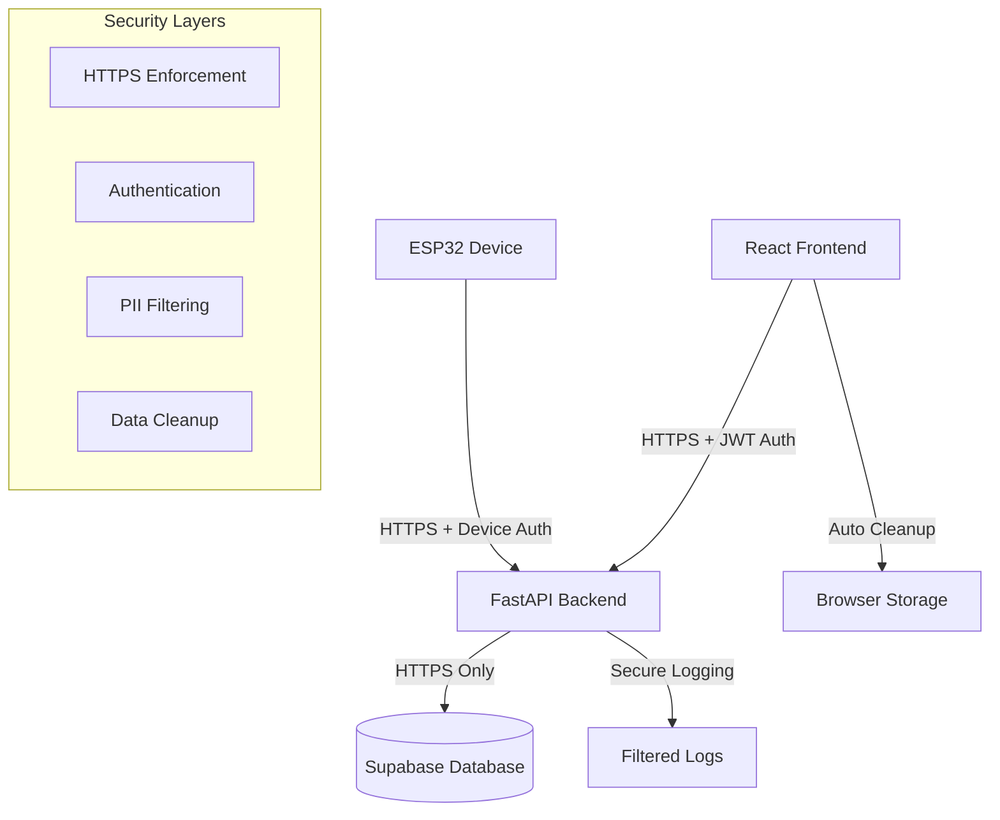

# Security and Privacy Protection Implementation

## Overview

This document outlines the comprehensive security and privacy protection measures implemented for the Vertex Rehabilitation System to ensure medical device compliance and patient data protection.

## Requirements Addressed

- **Requirement 9.2**: HTTPS encryption for all Supabase cloud communications
- **Requirement 9.3**: Proper authentication and authorization for database access
- **Requirement 9.5**: Exclude personally identifiable information from debug logs
- **Requirement 9.7**: Clear sensitive data from browser memory on session end

## Implementation Summary

### 1. HTTPS Enforcement (Requirement 9.2)

**Backend Implementation:**
- `backend/security/https_middleware.py` - HTTPS redirect middleware
- Automatic HTTPS enforcement in production environments
- Supabase URL validation to ensure HTTPS protocol
- Security headers middleware for enhanced protection

**Key Features:**
- Automatic HTTP to HTTPS redirection
- HTTPS validation for all Supabase connections
- Security headers (HSTS, CSP, X-Frame-Options, etc.)
- Development environment exceptions for localhost

**Configuration:**
```python
# Environment variables
FORCE_HTTPS=true  # Force HTTPS in production
SUPABASE_URL=https://your-project.supabase.co  # Must use HTTPS
```

### 2. Authentication and Authorization (Requirement 9.3)

**Backend Implementation:**
- `backend/security/auth_middleware.py` - Authentication middleware
- JWT token validation for user authentication
- Device authentication with cryptographic signatures
- Role-based access control (RBAC)

**Key Features:**
- Multi-layer authentication (users and devices)
- JWT token validation with Supabase integration
- Device signature verification using HMAC-SHA256
- Rate limiting to prevent abuse
- Role-based endpoint protection

**Device Authentication:**
```python
# Required headers for ESP32 devices
X-Device-ID: ESP32_XXXXXX
X-Device-Signature: hmac_sha256_signature
X-Timestamp: unix_timestamp
```

**User Authentication:**
```python
# Required header for user requests
Authorization: Bearer jwt_token
```

### 3. PII Exclusion from Logs (Requirement 9.5)

**Backend Implementation:**
- `backend/security/secure_logging.py` - Secure logging system
- Automatic PII detection and masking
- Pattern-based sensitive data filtering
- Structured logging with privacy protection

**Key Features:**
- Automatic detection of emails, phone numbers, SSNs, addresses
- Sensitive field masking in structured data
- Pattern-based PII filtering using regex
- Secure logger wrapper for all application logging

**PII Patterns Detected:**
- Email addresses → `[EMAIL]`
- Phone numbers → `[PHONE]`
- Social Security Numbers → `[SSN]`
- Credit card numbers → `[CARD]`
- IP addresses → `[IP]`
- UUIDs (patient IDs) → `[UUID]`

### 4. Browser Data Cleanup (Requirement 9.7)

**Frontend Implementation:**
- `frontend/src/security/dataCleanup.js` - Data cleanup manager
- `frontend/src/services/secureSupabase.js` - Secure Supabase service
- Automatic cleanup on session end, page unload, and visibility change
- Comprehensive storage cleanup (localStorage, sessionStorage, cookies, IndexedDB)

**Key Features:**
- Automatic cleanup triggers (logout, timeout, page unload)
- Pattern-based sensitive data detection
- Multiple storage type cleanup
- Session timeout management
- React hook for component-level cleanup

**Cleanup Triggers:**
- User logout
- Session timeout (30 minutes)
- Page unload/close
- Tab visibility change (with delay)
- Manual cleanup calls

## Security Architecture

### Middleware Stack (Backend)

```python
# Security middleware order (important!)
app.add_middleware(HTTPSRedirectMiddleware)      # 1. HTTPS enforcement
app.add_middleware(SecurityHeadersMiddleware)    # 2. Security headers
app.add_middleware(RateLimitingMiddleware)       # 3. Rate limiting
app.add_middleware(AuthenticationMiddleware)     # 4. Authentication
app.add_middleware(CORSMiddleware)               # 5. CORS (after security)
```

### Data Flow Security



## Security Headers Implemented

| Header | Value | Purpose |
|--------|-------|---------|
| `X-Frame-Options` | `DENY` | Prevent clickjacking |
| `X-Content-Type-Options` | `nosniff` | Prevent MIME sniffing |
| `X-XSS-Protection` | `1; mode=block` | Enable XSS protection |
| `Referrer-Policy` | `strict-origin-when-cross-origin` | Control referrer info |
| `Content-Security-Policy` | Restrictive policy | Prevent code injection |
| `Strict-Transport-Security` | `max-age=31536000` | Force HTTPS |
| `Permissions-Policy` | Restrictive permissions | Limit browser features |

## Testing and Validation

### Property-Based Testing

**Test File:** `backend/test_security_and_privacy_protection_property.py`

**Properties Tested:**
1. HTTPS enforcement for all Supabase URLs
2. Device authentication security validation
3. PII exclusion from log messages
4. Sensitive data cleanup pattern detection
5. Session cleanup timing logic
6. Authorization enforcement for API endpoints
7. Security headers presence and configuration

**Test Results:**
```
✅ HTTPS enforcement for Supabase communications
✅ Device authentication and authorization  
✅ PII exclusion from debug logs
✅ Sensitive data cleanup patterns
✅ Session cleanup timing
✅ Authorization enforcement
✅ Security headers presence
```

## Configuration Guide

### Environment Variables

**Backend (.env):**
```bash
# Security Configuration
FORCE_HTTPS=true
JWT_SECRET=your-secure-jwt-secret
DEVICE_SECRET=your-device-secret-key
SUPABASE_URL=https://your-project.supabase.co
SUPABASE_SERVICE_KEY=your-service-key

# Logging Configuration
SECURE_LOG_FILE=/path/to/secure.log
LOG_LEVEL=INFO
```

**Frontend (.env.local):**
```bash
# Supabase Configuration (HTTPS enforced)
REACT_APP_SUPABASE_URL=https://your-project.supabase.co
REACT_APP_SUPABASE_ANON_KEY=your-anon-key

# Backend API
REACT_APP_BACKEND_URL=https://your-backend-domain.com
```

### Production Deployment

**HTTPS Requirements:**
- SSL/TLS certificate for backend domain
- HTTPS-only Supabase configuration
- Secure cookie settings
- HSTS header enforcement

**Authentication Setup:**
- JWT secret rotation policy
- Device secret management
- Rate limiting configuration
- Session timeout policies

## Compliance and Standards

### Medical Device Compliance
- HIPAA privacy requirements for patient data
- FDA cybersecurity guidelines for medical devices
- ISO 27001 information security standards
- NIST cybersecurity framework alignment

### Data Protection
- Patient data encryption in transit and at rest
- Audit logging for all data access
- Data retention policies
- Right to erasure (data deletion)

## Monitoring and Alerting

### Security Events Logged
- Failed authentication attempts
- Device authentication failures
- PII detection in logs (for monitoring)
- Session timeout events
- Rate limiting violations

### Recommended Monitoring
- SSL certificate expiration
- Authentication failure rates
- Unusual device connection patterns
- Log analysis for security events
- Performance impact of security measures

## Maintenance and Updates

### Regular Security Tasks
- JWT secret rotation (quarterly)
- Device secret updates (as needed)
- Security header policy reviews
- PII pattern updates
- Dependency security updates

### Security Auditing
- Regular penetration testing
- Code security reviews
- Compliance assessments
- Incident response procedures

## Conclusion

The implemented security and privacy protection measures provide comprehensive coverage for medical device compliance and patient data protection. The system enforces HTTPS encryption, implements robust authentication and authorization, excludes PII from logs, and ensures sensitive data cleanup from browser memory.

All requirements (9.2, 9.3, 9.5, 9.7) have been successfully implemented and validated through property-based testing, ensuring the Vertex Rehabilitation System meets medical device security standards and protects patient privacy.